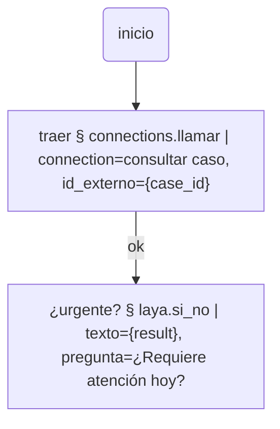

# connections

Llamadas HTTP guardadas, para cualquier instalación de `workflow-bot-core`:

- **Sources**: alimentan la grilla del panel principal. Se guarda una URL (y
  cómo leerla), y de ahí salen las filas, la clave de cada caso y las
  columnas.
- **Actions**: una llamada HTTP guardada (`connections.llamar` /
  `connections.llamar_y_fusionar`) que un nodo de un flujo dispara para traer
  un dato puntual y seguir con eso.

Se instala solo, sin dependencias. Pide el port `http`.

## De dónde viene

Nació como `webapp/connections`, un plugin propio de `workflow-bot-app` (no
instalable, con acceso privilegiado al store de Config de esa app). Esta es
la versión genérica, para usar en cualquier instalación del núcleo — otro
Bot, un deploy que no es esa webapp, etc. No es idéntica, por diseño:

### `{env.CLAVE}` se resuelve contra `os.environ`

Un source o una Action puede guardar `Bearer {env.API_TOKEN}` en vez del
token en claro. Si el host ya resuelve esa referencia antes de que el plugin
vea el item —como hace `workflow-bot-core` con cualquier colección leída por
`ctx.resource()` o `run_action(item=...)`, para cualquier plugin, no sólo
este— no hay nada que hacer: ya llega resuelto. La resolución propia de este
plugin es la red de contención para lo que todavía llegue literal, típicamente
"armar y probar" un source o una Action **antes** de guardarla (manda la
config cruda tal como está en el formulario, no pasa por esa colección).

En una instalación con su propio store de variables (ej. Config → Variables
de `workflow-bot-app`), alcanza con cargar la variable ahí. En el núcleo a
secas (por CLI, o un host sin ese store), exportarla como variable de entorno
del sistema antes de arrancar el Bot.

### No tapa secretos

La versión original conocía qué variables eran secretas (vía el store
privado de esa app) y las ocultaba de la traza del run y de la respuesta
mostrada en "Probar". Este plugin, como cualquier otro de terceros, no tiene
—ni debe tener— esa visibilidad. Implicancias prácticas:

- Preferir un **header** (`Authorization: Bearer {env.X}`) a una query
  string para un token: un header no se imprime en la traza del run (la línea
  de log sólo muestra método + URL).
- Si una API ajena repite el token en una respuesta de error, va a aparecer
  en claro en la pantalla de "Probar". Mismo riesgo que cualquier otro plugin
  que llame a una URL con un dato sensible adentro.

## Resources

### Sources

| Campo | Qué es |
|---|---|
| URL, Método, Headers, Payload | la llamada |
| Camino al array | ej. `data.items`; vacío si la raíz ya es la lista |
| Campo clave | qué campo de cada fila es el `case_id` |
| Flujo por defecto | con qué flujo corre cada fila |
| Columnas ocultas | qué columnas no dibuja la grilla (la fila entera sigue llegando al flujo) |
| Parámetro de página / tamaño / Camino al total | sólo si la API pagina — ver abajo |

Sin paginación declarada (`page_param` vacío): se trae la fuente entera y se
pagina en memoria, igual que un CSV cargado entero — buscar y filtrar miran
la fuente completa. Con `page_param`: se le pide página por página a la API
externa, y buscar/filtrar sólo alcanza a la página ya traída.

### Actions

URL, método, headers, payload y, opcional, el camino al resultado dentro de
la respuesta (para `{result}`).

## Tools de flujo

- **`connections.llamar`**: ejecuta una Action guardada. `{variable}` en su
  URL/headers/payload se sustituye primero contra cualquier param extra del
  propio nodo, y si no contra el contexto del run. Deja la respuesta en
  `{response}`, el status en `{status}` y, si la Action declara "camino al
  resultado", también en `{result}`.
- **`connections.llamar_y_fusionar`**: igual, y además vuelca cada campo de
  primer nivel de la respuesta directo al contexto del run (puede pisar una
  variable existente con el mismo nombre) — para cuando un nodo más adelante
  necesita leer un campo de la fila recién traída por su nombre, sin un
  segundo tool que lo saque de `{response}`.

La tarjeta del nodo, con una Action elegida, ofrece como params extra
exactamente las `{variables}` que esa Action usa en su URL, headers o
payload — no hace falta abrir Connections para saber cuáles son.

## Lo que queda afuera, a propósito

- Un origen de archivos (CSV, etc.) no es parte de este plugin.
- No tapa secretos en logs ni en respuestas (ver arriba): es la diferencia
  real con la versión bundled de `workflow-bot-app`.
- Sólo `http` como tipo de source, por ahora.
