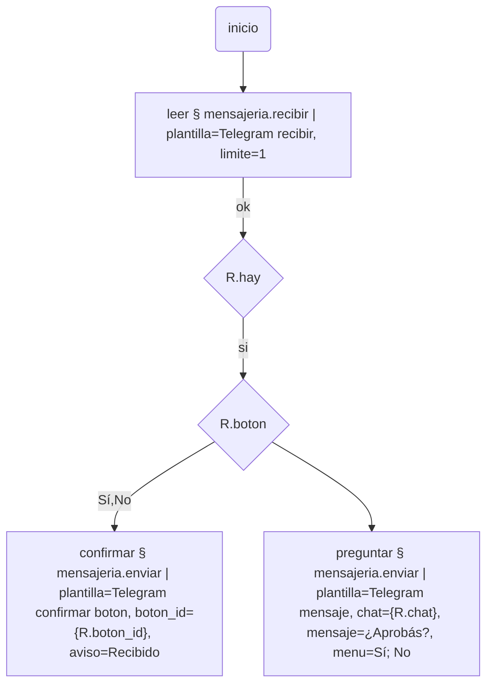

# mensajeria

Mandar y recibir mensajes por cualquier servicio de mensajería (Telegram,
WhatsApp, Slack, un sistema propio…) con **plantillas** que arma quien usa el
Bot. El plugin no sabe nada de ningún servicio: cada uno es una plantilla con
sus campos, y uno nuevo se suma cargando datos, no escribiendo código.

Se instala solo, sin dependencias. Pide los ports `http` (el servicio) y `fs`
(los archivos que se mandan).

## Una plantilla

Plug ins → Mensajería → Plantillas. Una por servicio **y** acción ("Telegram
mensaje", "Telegram archivo", "Telegram recibir"):

| Campo | Qué va |
|---|---|
| URL base | ej. `https://api.telegram.org/bot{env.TELEGRAM_TOKEN}`. El token en Config → Variables, como secreto |
| Headers | ej. `{"Authorization": "Bearer {env.TOKEN}"}` |
| Campos | **los que el nodo va a pedir**, en una lista (ver abajo) |
| Enviar | método, ruta, formato y cuerpo con `{campo}` |
| Recibir | ruta, dónde está la lista y qué columna sale de cada mensaje |
| Cursor | hasta dónde se leyó; lo lleva el plugin |

### Campos

```json
[
  {"nombre": "chat", "tipo": "texto", "obligatorio": true, "doc": "El chat_id"},
  {"nombre": "mensaje", "tipo": "texto", "obligatorio": true},
  {"nombre": "menu", "tipo": "lista", "separador": ";", "por_fila": 2,
   "item": {"text": "{valor}", "callback_data": "{valor}"}},
  {"nombre": "prioridad", "tipo": "texto", "defecto": "normal"}
]
```

| Tipo | Qué hace |
|---|---|
| `texto` | tal cual |
| `numero` | viaja como número |
| `lista` | `"Sí; No; Más tarde"` (o una lista JSON) → arreglo. Con `item`, cada valor pasa por ese molde (`{valor}`, `{indice}`); con `por_fila`, se agrupa en filas: un menú de botones |
| `json` | un objeto o arreglo |
| `archivo` | una ruta; se sube el archivo (formato `multipart`) |

En el editor del flujo, al elegir la plantilla, **sus campos aparecen como
params del nodo**, con su ayuda.

### Enviar

```json
{"metodo": "POST", "ruta": "/sendMessage", "formato": "json",
 "cuerpo": {"chat_id": "{chat}", "text": "{mensaje}",
            "reply_markup": {"inline_keyboard": "{menu}"}},
 "respuesta_id": "result.message_id"}
```

- `formato`: `json`, `form` o `multipart` (para archivos).
- Un `"{campo}"` que ocupa el valor entero conserva el tipo (un número, la
  lista del menú). Adentro de un texto se pega como texto.
- **Un campo opcional sin completar se saca del cuerpo**, y un objeto que queda
  vacío por eso también: sin menú, no se manda `reply_markup`.
- `respuesta_id`: dónde está el id del mensaje enviado, para `{id}`.

### Recibir

```json
{"ruta": "/getUpdates?offset={cursor}&timeout=0", "lista": "result", "id": "update_id",
 "salida": {"chat": "message.chat.id|callback_query.message.chat.id",
            "texto": "message.text|message.caption",
            "boton": "callback_query.data"}}
```

- `{cursor}` es hasta dónde se leyó; `id` es el campo numérico de cada mensaje
  con que se avanza (el siguiente arranca en el último + 1).
- En `salida`, `a.b|c.d` prueba el segundo camino si el primero no está; un
  índice `-1` es el último de una lista.

## Tools

Categoría **MENSAJERÍA**.

| Paso | Qué hace | Deja |
|---|---|---|
| `mensajeria.enviar \| plantilla=Telegram mensaje, chat={chat}, mensaje=Hola, menu=Sí; No` | manda con la plantilla | `{id}`, `{status}`, `{respuesta}` |
| `mensajeria.recibir \| plantilla=Telegram recibir, limite=10` | lee lo nuevo desde donde quedó | `{mensajes}`, `{primero}`, `{cantidad}`, `{hay}` (`si`/`no`), y cada columna de `salida` del primer mensaje suelta: `{chat}`, `{texto}`, `{boton}`… |

Lo leído no se vuelve a leer: el cursor se guarda antes de devolver los
mensajes. Si el flujo falla después, esos mensajes no vuelven (vaciar el
campo Cursor relee lo que el servicio todavía guarde).

## Telegram, armado

**Crear ejemplo de Telegram** (en Acciones) crea cuatro plantillas, que leen
el token de `TELEGRAM_TOKEN`:

- **Telegram mensaje**: `chat`, `mensaje`, `menu` (botones, dos por fila), `formato` (HTML/MarkdownV2).
- **Telegram archivo**: `chat`, `archivo`, `texto`.
- **Telegram recibir**: columnas `chat`, `texto`, `boton`, `boton_id`, `de`, `mensaje_id`, `archivo_id`.
- **Telegram confirmar boton**: `boton_id`, `aviso` — Telegram deja el botón
  "cargando" hasta que se le confirma.

Para usarlas:

1. En Telegram, hablarle a **@BotFather** → `/newbot` → copiar el token.
2. Config → Variables → `TELEGRAM_TOKEN`, como secreto.
3. Mandarle cualquier mensaje al bot nuevo desde tu cuenta, y correr
   `mensajeria.recibir | plantilla=Telegram recibir`: `{primero.chat}` es tu
   chat_id.



## Lo que no hace

- **Bajar los archivos recibidos**: el port `http` del núcleo devuelve el
  cuerpo como texto, así que un binario no llega entero. `{archivo_id}` sale
  igual, para cuando el núcleo lo permita.
- **Webhooks**: el servicio tendría que alcanzar al Bot por una dirección
  pública con HTTPS. Se lee consultando, que anda detrás de cualquier red.
- **Guardar el cursor** usa la API local del Bot (como `bots` y `oauth`).
