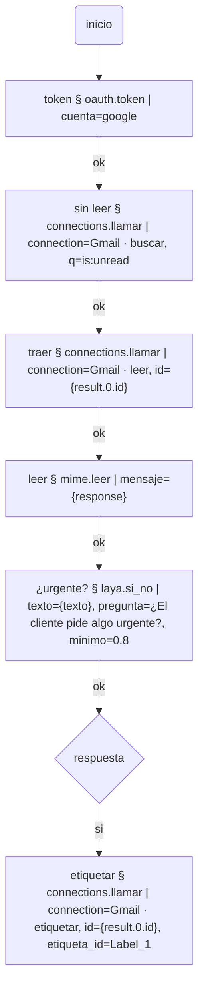

# oauth

Tokens OAuth 2.0 para que las conexiones de `connections` llamen a APIs como
las de Google (Gmail, Drive, Sheets, Calendar) o Microsoft. El token de acceso
vence (en Google, a la hora), así que un header fijo en una conexión deja de
andar enseguida. Este plugin guarda el refresh token de cada cuenta como
secreto, pide un token nuevo cuando hace falta y lo deja en una **variable de
Config** (secreta). Las conexiones lo leen así:

```
Authorization: Bearer {env.GOOGLE_TOKEN}
```

Las llamadas a cada API no son código de este plugin: son conexiones. Para
Gmail, un botón las crea todas.

Se instala solo, sin dependencias. Pide los ports `http` y `clock`.

## 1. Crear el cliente en Google Cloud Console (una vez)

1. En [console.cloud.google.com](https://console.cloud.google.com), crear un
   proyecto (o usar uno).
2. **APIs y servicios → Biblioteca**: habilitar las APIs que se van a usar
   (Gmail API, Google Drive API…).
3. **APIs y servicios → Pantalla de consentimiento de OAuth**: tipo *Interno*
   si la cuenta es de Google Workspace (sólo usuarios de la organización); si
   no, *Externo* y agregar como usuario de prueba la cuenta que va a autorizar.
4. **APIs y servicios → Credenciales → Crear credenciales → ID de cliente de
   OAuth**, tipo **App de escritorio**. Copiar el *Client ID* y el *Client
   secret*.

Con "App de escritorio" Google acepta volver a `http://127.0.0.1:<puerto>/`,
que es la dirección de este Bot: no hace falta registrar nada más.

## 2. Cargar la cuenta en el Bot

Plug ins → OAuth → Cuentas OAuth → nueva:

| Campo | Qué va |
|---|---|
| Nombre | cómo la nombran los flujos, ej. `google` |
| Proveedor | `google` |
| Client ID / Client secret | los del paso anterior |
| Permisos (scopes) | separados por espacio. Gmail: `https://www.googleapis.com/auth/gmail.modify` (leer, etiquetar, archivar y enviar). Drive: `https://www.googleapis.com/auth/drive` |
| Variable del token | `GOOGLE_TOKEN` (o la que se quiera): donde queda el token vigente |

## 3. Autorizar (dos pasos, una vez)

1. **Autorizar** con `codigo` vacío: se abre la pantalla de Google. Elegir la
   cuenta y aceptar.
2. El navegador vuelve a este Bot con `?code=…` en la dirección. Copiar esa
   dirección **entera**, pegarla en `codigo` y apretar **Autorizar** otra vez.

Queda guardado el refresh token (secreto) y el primer token en la variable.
**Probar** pide uno nuevo y confirma que todo anda.

Si el navegador está en otra PC (el Bot se abre por la red), la vuelta a
`127.0.0.1` falla en esa PC: no importa, la dirección con el `code` igual
aparece en la barra y es lo que se copia.

## 4. Conexiones de Gmail

**Crear conexiones de Gmail** (en la cuenta) crea en Conexiones, con
`Bearer {env.<variable de la cuenta>}`:

| Conexión | Qué hace | Lo que pide el nodo |
|---|---|---|
| Gmail · buscar | busca con la sintaxis de Gmail; `{result}` es la lista de `{id, threadId}` | `q` (ej. `is:unread from:x`) |
| Gmail · leer | el mail en formato `raw`, para `mime.leer` | `id` |
| Gmail · archivar | lo saca de la bandeja de entrada | `id` |
| Gmail · marcar leído | le saca UNREAD | `id` |
| Gmail · etiquetar | le pone una etiqueta | `id`, `etiqueta_id` |
| Gmail · etiquetas | las etiquetas de la cuenta, con su id | — |
| Gmail · enviar | manda un mail armado con `mime.armar` | `raw` |
| Gmail · responder | lo mismo, en el hilo | `raw`, `thread_id` |
| Gmail · adjunto | un adjunto grande, para `mime.guardar_base64` | `id`, `adjunto_id` |

Las que ya existen con el mismo nombre no se tocan (salvo con `pisar`).

## En un flujo

`oauth.token` como primer nodo deja un token vigente en la variable (si el que
hay sirve, no pide otro), y los nodos que siguen usan las conexiones:



Un source de Connections también puede usar `{env.GOOGLE_TOKEN}` en sus
headers; el token lo mantiene vigente cualquier flujo que corra `oauth.token`.

## Lo que queda afuera, a propósito

- **El token no sale como output** de ningún tool: quedaría en claro en la
  traza del run. Sale sólo por la variable secreta.
- **Cómo escribe**: guardar el refresh token, la variable y las conexiones son
  escrituras en el propio Bot por su API local (`127.0.0.1`), igual que
  `bots.migrar`. Si esa API pasa a pedir autenticación, esto tiene que acompañar.
- **Microsoft** trae sus URLs pero no está probado contra una cuenta real; hay
  que registrar `http://127.0.0.1:<puerto>/` como redirect de la app y sumar
  `offline_access` a los scopes.
